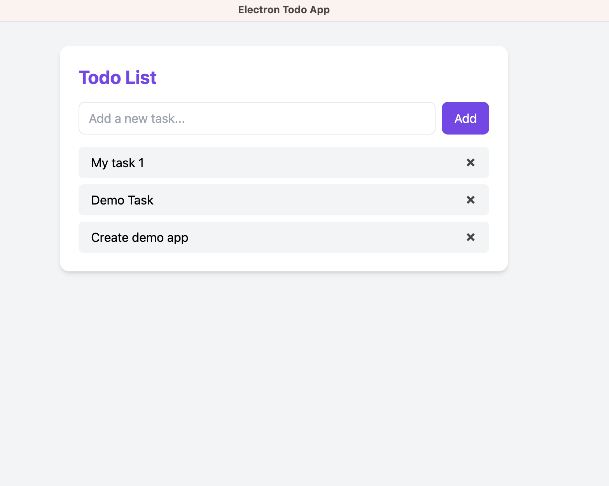

# 📝 Electron Todo App

A simple desktop Todo application built with **Electron** and styled using **Tailwind CSS**. This app demonstrates how to build cross-platform desktop apps using web technologies.



---

## ✨ Features

- ✅ Add and manage simple todo tasks
- 💡 Built with [Electron](https://www.electronjs.org/)
- 🎨 Styled using [Tailwind CSS](https://tailwindcss.com/)
- 🛠 DevTools available from the menu

---

## 📦 Installation

Make sure you have **Node.js** installed on your system.

```bash
git clone https://github.com/hameed-fu/electron-todo-app.git
cd electron-todo-app
npm install
